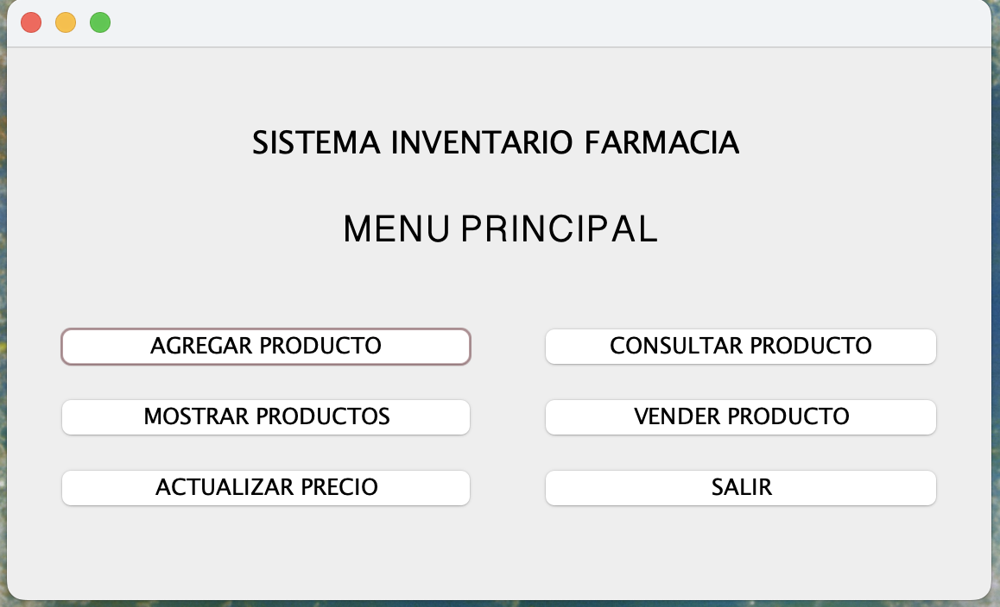
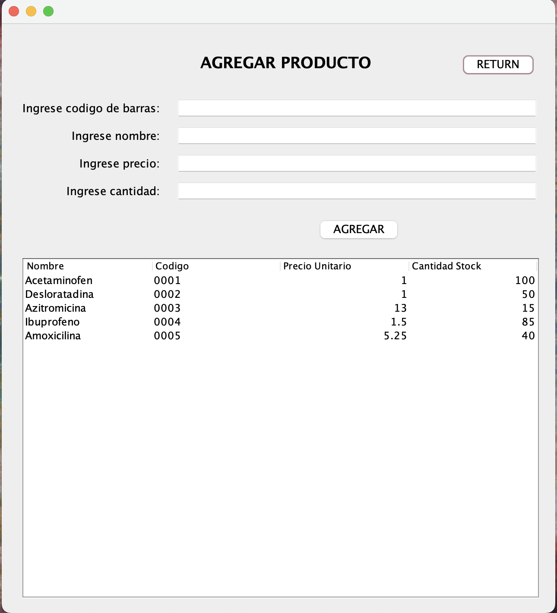
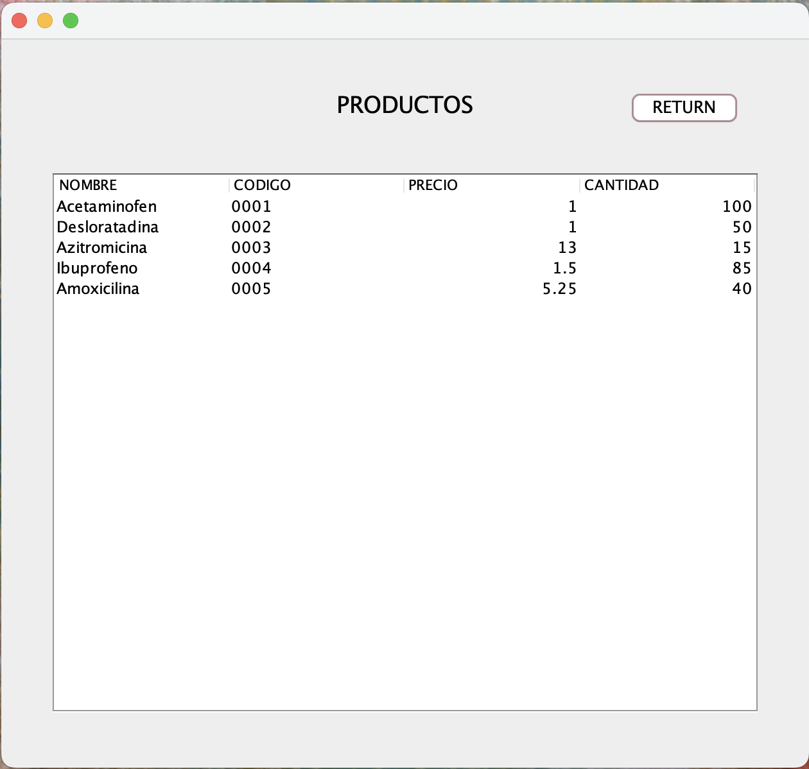
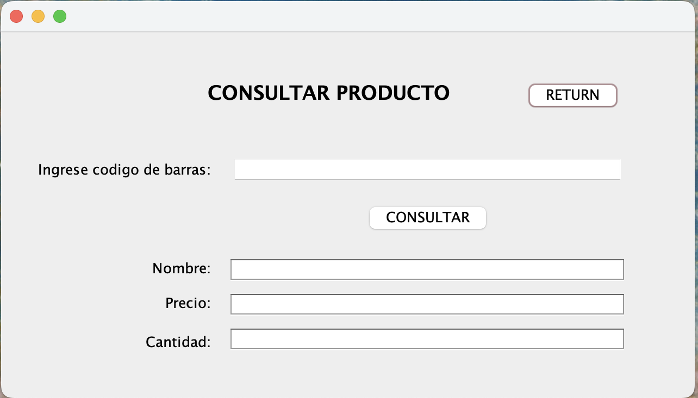
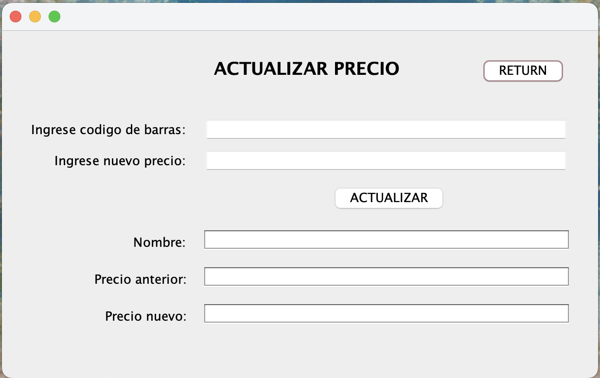
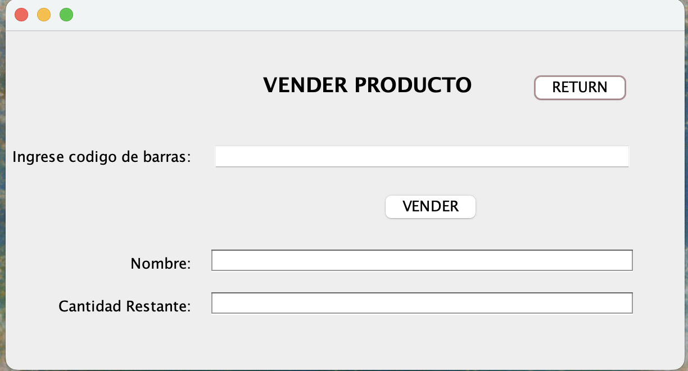

# Sistema de Inventario para Farmacia

Este proyecto es una aplicación de escritorio desarrollada en Java Swing que permite gestionar un inventario de productos farmacéuticos. Fue creado como parte de una práctica de programación orientada a objetos.

---

##  Funcionalidades implementadas

- **Agregar producto**: Permite ingresar un nuevo medicamento al inventario, validando que no exista ya un producto con el mismo código de barras.
- **Consultar producto**: Muestra el nombre, precio y stock de un producto buscado por su código.
- **Actualizar precio**: Permite modificar el precio unitario de un producto existente.
- **Mostrar productos**: Despliega todos los productos del inventario en una tabla.
- **Vender producto**: Descuenta del stock la cantidad vendida, validando disponibilidad.
- **Validaciones**: Se muestran diálogos de error en caso de código inexistente, duplicado o campos vacíos.

---

## Instrucciones de uso

1. **Compila y ejecuta** el archivo `VentanaPrincipal.java` desde tu entorno (recomendado: NetBeans).
2. Navega por las distintas opciones del menú:
   - Agrega productos usando “Agregar Producto”.
   - Consulta, vende o actualiza productos existentes.
   - Visualiza el inventario completo con “Mostrar Productos”.
3. Al cerrar una ventana, se retorna automáticamente al menú principal.

> Todos los cambios se mantienen mientras la aplicación está abierta, usando una instancia compartida de inventario.

---
[Ver demostración en video] https://drive.google.com/drive/folders/1Xg_UfBdjPZ3XOdoZAwDeI8f-njRrFFfA?usp=sharing

- Capturas de pantalla

### Menú principal

### Agregar producto

### Mostrar productos

### Consultar productos

### Actualizar productos

### Vender productos

